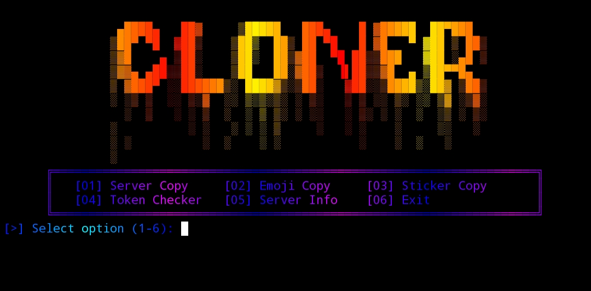

# Discord Server Cloner
Discord Server Cloner Made In Python

# Features
Server Channel Clone

Server Role Clone

Server Emoji Clone

Server Sticker Clone

# Preview

<p align="center">
  
</p>

# Installation
```
git clone https://github.com/yup-console/Cloner
cd Cloner
pip install -r r.txt
python cloner.py
```

# How To Use
Enter Bot/User Token In token.txt File

Run The cloner.py File

Enter Server Ids

Then Let The Cloner Do Rest Of It :)
